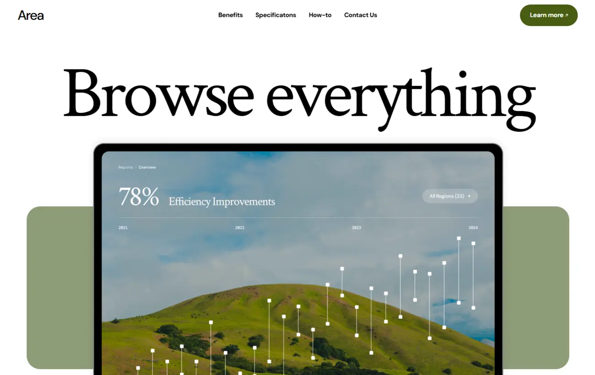
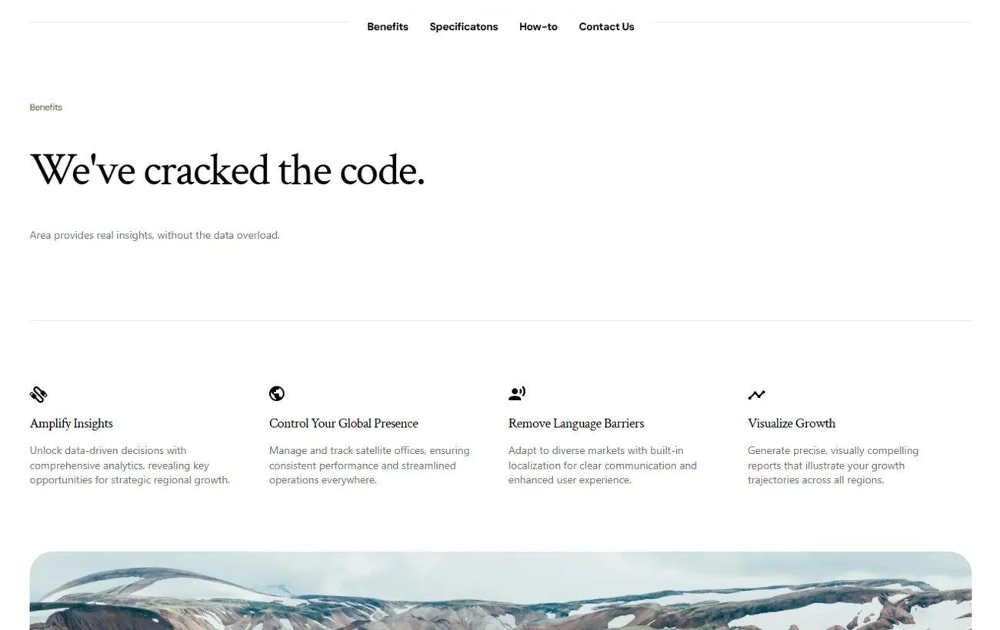
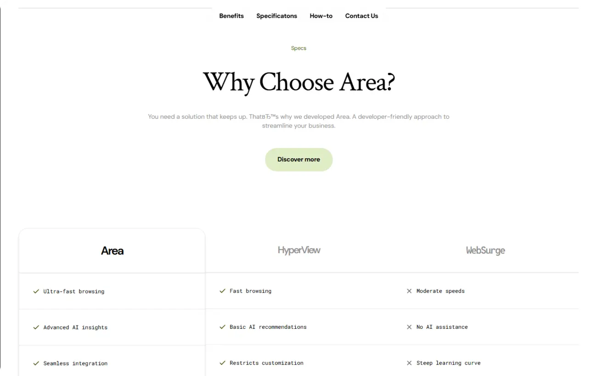
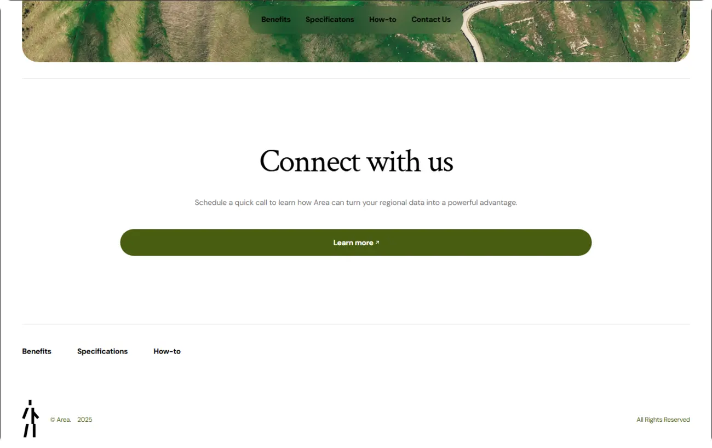
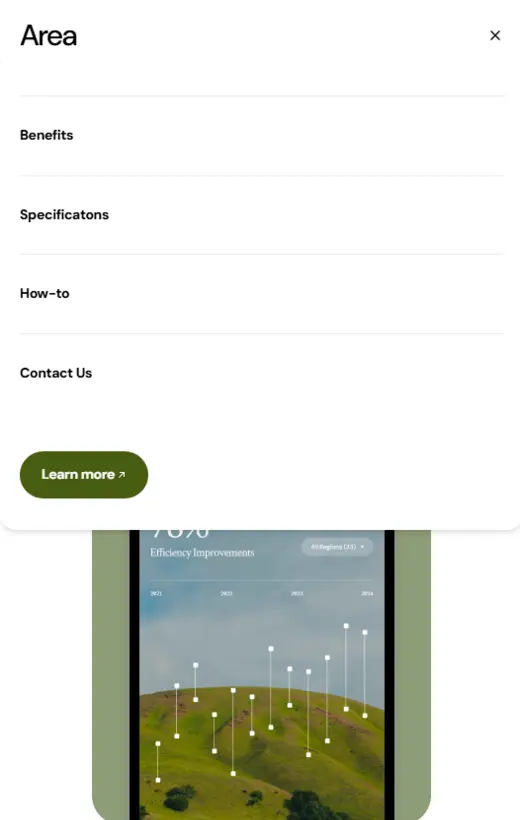

<h1>About the repository</h1>
Layout of the Area website from the mockup: <a href="https://www.figma.com/community/file/1487309170684591074/modern-product-launch.">https://www.figma.com/community/file/1487309170684591074/modern-product-launch.</a> 

<h2>Demo</h2>

    
    
    
    
    

<h2>Stack</h2>
<ul>
    <li>
        
        HTML5
    </li>
    <li>
        
        Tailwind CSS
    </li>
    <li>
        
        JavaScript<i> (only for animations)</i>
    </li>
</ul>

<h2>How to use</h2>
<ol>
    <li>Download the repo.  </li>
    <li>Open the project folder in an IDE/Terminal.  </li>
    <li>Enter in the terminal <code>npm run dev</code></li>
</ol>

<h2>License</h2>
This project is licensed under the <a href="./LICENSE" target="_blank">MIT License</a>.

